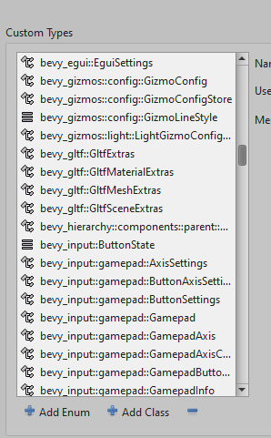

# Use Tiled custom properties

In Tiled we can add "custom properties" on various items like layers, tiles, objects or maps.

These custom properties can be either:

- a "standard type", like a string, an integer, a float, a color, etc...
- a "custom type", which is basically a structure with sub-properties that can either be a "standard type" or another "custom type"

In `bevy_ecs_tiled` we support mapping a Tiled "custom type" to a Bevy `Component`, `Bundle` or even `Resource`.
Basically, it means that we can define some game logic directly in the Tiled map to use it in your game with Bevy.

Using this mechanism, we could for instance:

- associate a "movement cost" to a given tile type
- create an object that represent our player or an ennemy
- add a generic "trigger zone" that could either be a "damaging zone" or a "victory zone"
- ... whatever you need for your game!

In addition to this guide, there is also a [dedicated example](https://github.com/adrien-bon/bevy_ecs_tiled/blob/main/examples/properties_basic.rs).

## Declare types to be used as custom properties

Your Tiled map, layer, tile or object will be represented by a Bevy `Entity`.
So, it makes sense that if you want to add custom properties to them, these properties should either be a `Component` or a `Bundle`.

Also, Tiled custom properties use Bevy `Reflect` mechanism.
So, in order to be usable in Tiled, your custom types must be "Reflectable".
To do, these types must derive the `Reflect` trait and get registered with Bevy.

```rust, no_run
use bevy::prelude::*;

// Declare a component that is "reflectable"
#[derive(Component, Reflect, Default)]
#[reflect(Component, Default)]
struct SpawnInfos {
    has_spawned: bool,
    ty: SpawnType,
}

// Any 'sub-type' which is part of our component must also be "reflectable"
#[derive(Default, Reflect)]
#[reflect(Default)]
enum SpawnType {
    #[default]
    Unknown,
    Player,
    Enemy,
}

// Register our type with Bevy
fn main() {
    App::new()
        .register_type::<SpawnInfos>();
}
```

And that's all !

Note that in the above example, our custom type also derive the `Default` trait.
It is particulary useful to do so: if you don't, you would have to fill all the fields of your custom type when you use it in Tiled.

Finally, note that you can also add `Resource` to your map.
They won't be attached to a particular entity and as such are only allowed on Tiled maps.

## Add custom properties to your map

Before you can add custom properties to your map, you will need to export them from Bevy then import them in Tiled.

When running with the `user_properties` feature, your app will automatically produce an export of all types registered with Bevy.
By default, this file will be produced in your workspace with the name `tiled_types_export.json`.
You can change this file name or even disable its production by tweaking the `TiledMapPlugin` configuration (see [`TiledMapPluginConfig`](https://docs.rs/bevy_ecs_tiled/latest/bevy_ecs_tiled/struct.TiledMapPluginConfig.html)).

You can then import this file to Tiled.
To do so, in Tiled, navigate to View -> Custom Types Editor:


Click on the `Import` button and load your file:


Once it is done, you will be able to see all the custom types that you have imported from your application.
Note that it concerns all the types that derive the `Reflect` trait: there can be quite a lot !



You can now add them to different elements of your map, like tiles objects, layers or the map itself.
For more information on how to do add custom properties, see the [official TIled documentation](https://doc.mapeditor.org/en/stable/manual/custom-properties/).
You should only add properties imported from Bevy: adding ones that you created only in Tiled will not be loaded.
